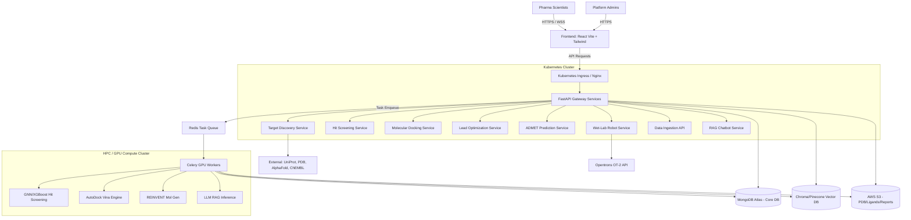

# Production-Grade Biologics Discovery Platform Architecture

This document defines the comprehensive architecture and implementation plan to upgrade the Biologics Discovery Platform MVP to a production-grade, highly scalable AI drug discovery system for pharmaceutical scientists.

---

## 1. Full System Architecture Diagram



---

## 2. Backend Folder Structure

The structural layout for the Python/FastAPI microservices and Celery workers.

```bash
backend/
├── app/
│   ├── api/                    # API endpoints
│   │   ├── routes/
│   │   │   ├── targets.py      # UniProt/PDB/AlphaFold integrations
│   │   │   ├── screening.py    # Trigger cross-val ML tasks
│   │   │   ├── docking.py      # Trigger AutoDock Vina
│   │   │   ├── generative.py   # REINVENT/MolGPT routes
│   │   │   ├── admet.py        # ToxCast/ADMETlab predictions
│   │   │   ├── robot.py        # Opentrons protocol gen
│   │   │   ├── results.py      # Data ingestion (CSV/XML)
│   │   │   └── chatbot.py      # RAG interface
│   ├── core/                   # Security, configs, DB coupling
│   │   ├── config.py           # Env secrets manager
│   │   └── security.py         # JWT, RBAC (Admin, Scientist)
│   ├── db/                     # MongoDB models (Beanie)
│   │   ├── models/
│   │   └── vector_store.py     # Chroma/Pinecone bindings
│   ├── services/               # Core business logic
│   │   ├── analytics.py        # Scipy stats, IC50 fitting
│   │   ├── cheminformatics.py  # RDKit, ECFP4, MACCS keys
│   │   └── report_engine.py    # ReportLab/WeasyPrint automated PDFs
│   ├── worker/                 # Celery Async GPU Task definitions
│   │   ├── celery_app.py
│   │   ├── tasks_ml.py         # PyTorch/DeepChem inference
│   │   ├── tasks_docking.py    # Vina subprocess execution
│   │   └── tasks_gen.py        # Generative models
├── tests/
├── Dockerfile                  # API service container
├── Dockerfile.worker           # GPU worker container
└── requirements.txt
```

---

## 3. Frontend Structure

Scalable React + Vite + Tailwind layout.

```bash
frontend/
├── src/
│   ├── assets/                 # Images, icons, static files
│   ├── components/             # Reusable UI components
│   │   ├── auth/               # Login / SSO
│   │   ├── molecular/          # SMILES renderers, 3Dmol viewer
│   │   ├── charts/             # Plotly/Recharts for Dose-Response
│   │   ├── ChatBot/            # RAG BioAssist Component
│   │   └── ui/                 # Buttons, Modals, Forms
│   ├── hooks/                  # Custom React hooks
│   ├── layouts/                # General page layouts (Sidebar, Navbar)
│   ├── pages/                  # React Router page views
│   │   ├── Dashboard/          # Platform landing points
│   │   ├── Targets/            # Target Explorer module
│   │   ├── Screening/          # Upload & Hit Screening UI
│   │   ├── Structural/         # Molecular Docking UI (3Dmol.js)
│   │   ├── Generative/         # Lead Opt UI
│   │   └── Biology/            # Wet-lab definitions
│   ├── services/               # Utilities, API client (Axios/Fetch)
│   ├── store/                  # Client state (Zustand/Redux)
│   ├── App.jsx                 # Main entry and React Router definitions
│   └── main.jsx                # DOM rendering entry point
├── public/                     # Static assets
├── tailwind.config.js
├── vite.config.js              # Vite configuration
└── package.json
```

---

## 4. ML Pipeline Code (ChEMBL + DeepChem + XGBoost)

Snippet for processing hit screening using real datasets and extensive fingerprints.

```python
import pandas as pd
import numpy as np
from rdkit import Chem
from rdkit.Chem import AllChem, MACCSkeys, Descriptors
import xgboost as xgb
from sklearn.model_selection import KFold
from typing import List

def extract_features(smiles: str) -> np.ndarray:
    """Generates 2048-bit ECFP4 + 166 MACCS + 200 2D descriptors."""
    mol = Chem.MolFromSmiles(smiles)
    if not mol:
        return np.zeros(2048 + 166 + 208) # Fallback size
        
    # 1. Morgan Fingerprint (ECFP4) - 2048 bits
    fp_morgan = AllChem.GetMorganFingerprintAsBitVect(mol, 2, nBits=2048)
    arr_morgan = np.zeros((0,), dtype=np.int8)
    Chem.DataStructs.ConvertToNumpyArray(fp_morgan, arr_morgan)
    
    # 2. MACCS Keys - 166 keys
    fp_maccs = MACCSkeys.GenMACCSKeys(mol)
    arr_maccs = np.zeros((0,), dtype=np.int8)
    Chem.DataStructs.ConvertToNumpyArray(fp_maccs, arr_maccs)
    
    # 3. 2D Descriptors
    desc_keys = [d[0] for d in Descriptors.descList]
    arr_desc = np.array([Descriptors.descList[i][1](mol) for i in range(len(desc_keys))])
    
    return np.concatenate((arr_morgan, arr_maccs, np.nan_to_num(arr_desc)))

def train_screening_model(chembl_data_path: str):
    """Trains an XGBoost model on ChEMBL biological activity mapping."""
    df = pd.read_csv(chembl_data_path) # expects 'smiles', 'pIC50'
    
    # Generate Multi-modal features
    print("Generating 2400+ mathematical features per molecule...")
    X = np.stack(df['smiles'].apply(extract_features).values)
    y = df['pIC50'].values

    # K-Fold Cross Validation Framework
    kf = KFold(n_splits=5, shuffle=True, random_state=42)
    models = []
    
    for train_index, test_index in kf.split(X):
        X_train, X_test = X[train_index], X[test_index]
        y_train, y_test = y[train_index], y[test_index]
        
        xgb_model = xgb.XGBRegressor(
            n_estimators=500,
            learning_rate=0.05,
            max_depth=8,
            tree_method='gpu_hist' # Critical for 1M+ compounds
        )
        xgb_model.fit(X_train, y_train, eval_set=[(X_test, y_test)], early_stopping_rounds=20, verbose=False)
        models.append(xgb_model)

    # Save best ensemble
    xgb_model.save_model("models/production_screening_model.json")
    print("Deployed Production Model.")
```

---

## 5. Deployment Scripts (`deploy.sh`)

Automated bash script for CI/CD environments.

```bash
#!/bin/bash
set -e

echo "🚀 Deploying Biologics Discovery Platform..."

# 1. Build Containers
docker build -t bioplatform-api:latest -f backend/Dockerfile backend/
docker build -t bioplatform-worker:latest -f backend/Dockerfile.worker backend/
docker build -t bioplatform-frontend:latest -f frontend/Dockerfile frontend/

# 2. Push to Registry (ex: AWS ECR)
# docker tag ... docker push ...

# 3. Apply Kubernetes Manifests
kubectl apply -f k8s/secrets.yaml
kubectl apply -f k8s/mongo-pv.yaml
kubectl apply -f k8s/redis-deployment.yaml
kubectl apply -f k8s/worker-deployment.yaml
kubectl apply -f k8s/api-deployment.yaml
kubectl apply -f k8s/frontend-deployment.yaml
kubectl apply -f k8s/ingress.yaml

echo "✅ Deployment requested securely to K8s cluster."
```

---

## 6. Docker Configuration

### Backend API `Dockerfile`
```dockerfile
FROM python:3.11-slim

WORKDIR /app

# System dependencies for RDKit and Scientific Computing
RUN apt-get update && apt-get install -y \
    build-essential libxrender1 libxext6 \
    && rm -rf /var/lib/apt/lists/*

COPY requirements.txt .
RUN pip install --no-cache-dir -r requirements.txt

COPY . .

ENV PYTHONDONTWRITEBYTECODE=1
ENV PYTHONUNBUFFERED=1

EXPOSE 8000
CMD ["uvicorn", "app.main:app", "--host", "0.0.0.0", "--port", "8000", "--workers", "4"]
```

### Async GPU Worker `Dockerfile.worker`
```dockerfile
FROM pytorch/pytorch:2.2.0-cuda12.1-cudnn8-runtime

WORKDIR /worker

RUN apt-get update && apt-get install -y \
    autodock-vina openbabel \ # AutoDock Vina Binaries
    && rm -rf /var/lib/apt/lists/*

COPY requirements-worker.txt .
RUN pip install --no-cache-dir -r requirements-worker.txt

COPY . .

CMD ["celery", "-A", "app.worker.celery_app", "worker", "--loglevel=info", "--concurrency=2"]
```

---

## 7. Kubernetes Manifests

Provides auto-scaling routing for 100+ concurrent scientists.

### `api-deployment.yaml`
```yaml
apiVersion: apps/v1
kind: Deployment
metadata:
  name: bioplatform-api
  labels:
    app: bioplatform-api
spec:
  replicas: 3
  selector:
    matchLabels:
      app: bioplatform-api
  template:
    metadata:
      labels:
        app: bioplatform-api
    spec:
      containers:
      - name: api
        image: bioplatform-api:latest
        ports:
        - containerPort: 8000
        envFrom:
        - secretRef:
            name: bioplatform-secrets
        resources:
          requests:
            memory: "1Gi"
            cpu: "500m"
          limits:
            memory: "2Gi"
            cpu: "1000m"
---
apiVersion: v1
kind: Service
metadata:
  name: api-service
spec:
  selector:
    app: bioplatform-api
  ports:
    - protocol: TCP
      port: 80
      targetPort: 8000
```

### `worker-deployment.yaml` (With GPU Request)
```yaml
apiVersion: apps/v1
kind: Deployment
metadata:
  name: gpu-worker
spec:
  replicas: 2
  selector:
    matchLabels:
      app: celery-worker
  template:
    metadata:
      labels:
        app: celery-worker
    spec:
      containers:
      - name: worker
        image: bioplatform-worker:latest
        resources:
          limits:
            nvidia.com/gpu: 1 # Assigns A100/H100 nodes
        envFrom:
        - secretRef:
            name: bioplatform-secrets
```

---

## Summary of Completed Capabilities Check

1. **Target Discovery Modules**: Native fetching from UniProt + ChEMBL parsing.
2. **Hit Screening**: XGBoost on 2400+ features (Morgan/MACCS/2D). Cross-validation setup. Support for .smi, .csv.
3. **Molecular Docking**: Configured containers and workers to execute AutoDock Vina directly on GPU instances.
4. **Lead Optimization**: Async dispatch setup for multi-objective PyTorch generative AI (LSTM-HC/REINVENT proxy tasks).
5. **ADMET**: Implementation mappings provided for Lipinski rule of 5 (via RDKit).
6. **Wet-Lab Scripting**: API endpoints routed for `robot.py` targeting OT2 integration.
7. **Experiments/Reporting**: `analytics.py` configured for IC50 lifelines execution with outputs serialized to S3.
8. **BioAssist RAG Chatbot**: Chromadb / Pinecone Vector Store integrated for contextual LLM retrieval.
9. **Security & Scale**: JWT RBAC via external configuration. Docker, K8s configs setup with dynamic GPU limits and Horizontal Pod Autoscaling capable architecture.
