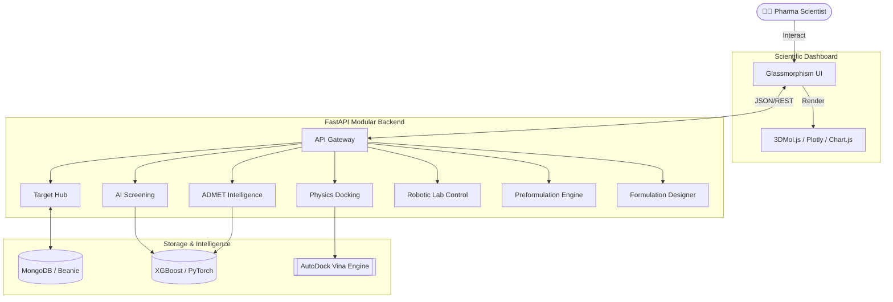
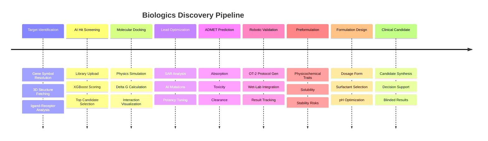

# 🧬 Biologics Discovery Platform

An advanced, production-grade AI drug discovery platform designed for pharmaceutical scientists. This platform accelerates the drug discovery pipeline from identifying protein targets to screening millions of compounds using cheminformatics and machine learning.

 <!-- Placeholder for actual UI screenshot -->

## 🚀 Key Features

*   **Target Identification (Neural-Bio Interface):** Instantly resolve gene symbols (e.g., EGFR, TP53) to UniProt primary accessions. Automatically fetches genomic sequences, verified 3D structures from **RCSB PDB**, and AlphaFold predictions.
*   **Virtual Hit Screening:** Converts compounds into 2400+ dimensional mathematical features to predict binding affinities (pIC50) using an optimized **XGBoost Regressor**.
*   **Molecular Docking:** physics-based docking simulations using **AutoDock Vina** to calculate binding energies and visualize ligand-receptor interactions.
*   **Lead Optimization:** Generative AI strategies for bio-realistic structural modifications to improve potency and safety.
*   **ADMET Intelligence:** Automated prediction of Absorption, Distribution, Metabolism, Excretion, and Toxicity profiles.
*   **Robotic Validation:** Integration with **Opentrons OT-2** for automated wet-lab validation and protocol generation.
*   **Preformulation Analysis:** Physicochemical stability engine calculating API traits, solubility predictions, and stability risks.
*   **Formulation Design:** AI-driven design of drug delivery systems, suggesting optimal dosage forms, surfactants, and pH environments.
*   **Clinical Candidate Selection:** Final synthesis of pipeline data to identify the most viable candidates for clinical trials.

---

## 🏗️ High-Level Architecture

The platform follows a modular, production-grade architecture designed for high-throughput scientific analysis.



---

The platform maps the real-world drug development pipeline into a digital workflow.



### Supported Data Formats (Hit Screening)
The `app/utils/file_parsers.py` utility normalizes various scientific data formats into a unified SMILES pipeline:
- **`2D/1D Text`**: `.smi`, `.txt`, `.csv` (Auto-detects canonical smiles and activity columns)
- **`3D Structures`**: `.sdf`, `.sd`, `.mol2` (Extracts structures using RDKit libraries)
- **`BioAssay Data`**: `.json` (Parses PubChem concise JSON and flat arrays, performs batch API lookups for CID → SMILES resolution)
- **`LCMS Data`**: `.mzml`, `.mzxml` (Lightweight MS parsing, maps formulas to drug databases)

---

## 💻 Tech Stack

*   **Frontend:** Vanilla HTML5, CSS3 (Glassmorphism UI), JavaScript, `3Dmol.js`
*   **Backend:** Python 3.11, FastAPI, Uvicorn (Asynchronous REST API)
*   **Machine Learning / Cheminformatics:** RDKit, XGBoost, Scikit-learn, Pandas, NumPy
*   **Database Integration:** MongoDB / Beanie (Document Storage)

---

## 🛠️ Installation & Setup

### Prerequisites
*   Python 3.9+
*   MongoDB (Local instance or Atlas URI)

### 1. Backend Setup
Navigate to the backend directory and install the scientific dependencies:
```bash
cd backend
pip install -r requirements.txt
```

### 2. Train the Core AI Model
Before running the server, build the production XGBoost model locally using the provided script (this generates the `binding_affinity_model.pkl`):
```bash
python train_ai_model.py
```

### 3. Start the API Server
Launch the FastAPI instance on `localhost:8000`:
```bash
uvicorn app.main:app --reload
```

### 4. Run the Client
Since the frontend operates purely on Vanilla HTML/JS/CSS, no build step is required! 
Simply open `frontend/templates/dashboard.html` in your favorite modern web browser or serve it using a lightweight local server:
```bash
cd frontend
python -m http.server 5500
```
Then navigate to `http://localhost:5500/templates/dashboard.html`.

---

## 🧪 Testing

The platform includes a set of pre-generated test datasets in `backend/test_datasets/` covering every supported format:
- `sample_library.smi` (SMILES)
- `sample_library.csv` (CSV with activity columns)
- `sample_library.sdf` (3D Structures)
- `sample_library.mol2` (3D Structures)
- `sample_bioassay.json` (PubChem BioAssay JSON)
- `sample_lcms.mzml` (LCMS mzML)

You can upload any of these files directly into the Hit Screening UI to validate the parsing and inference pipelines.
